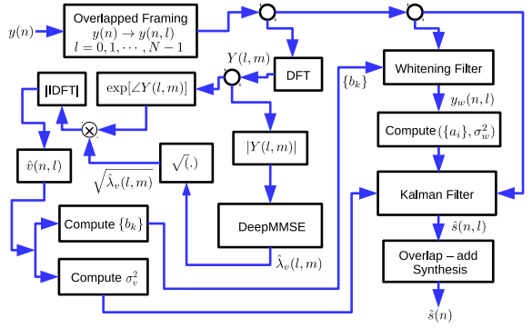
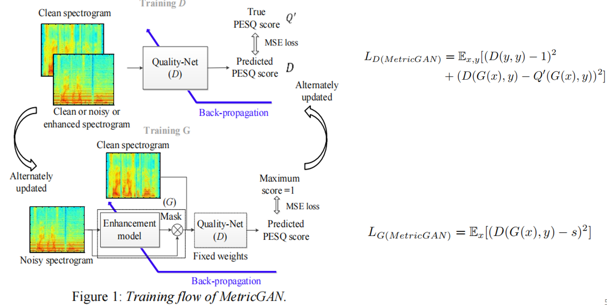
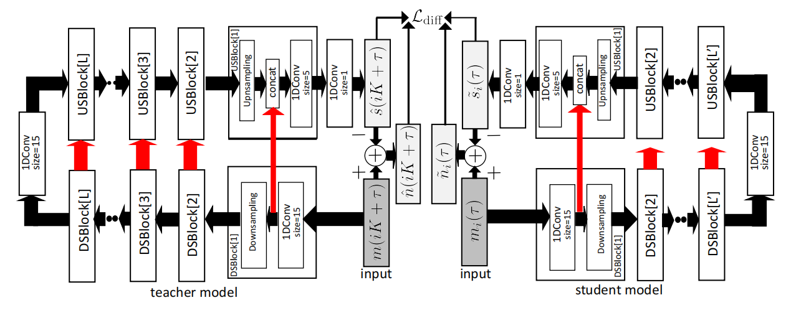
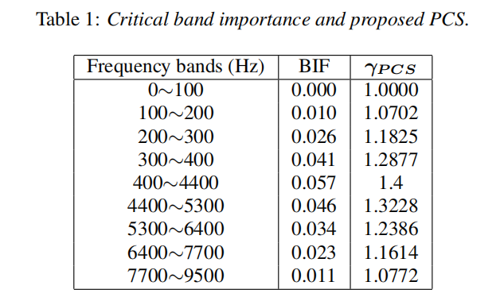
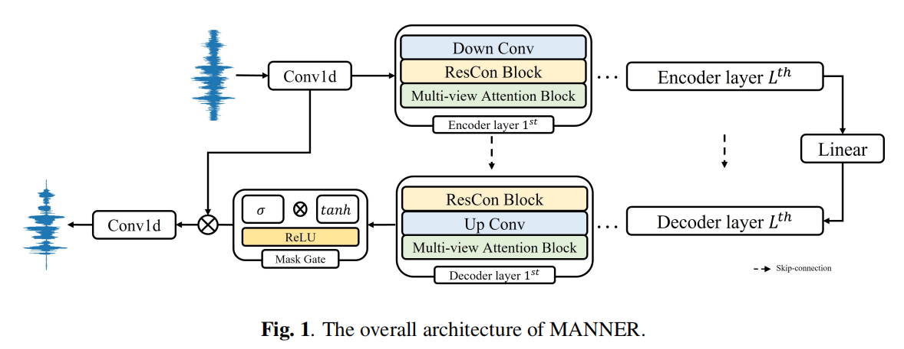
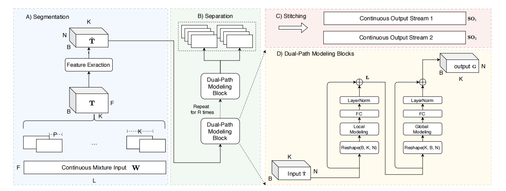
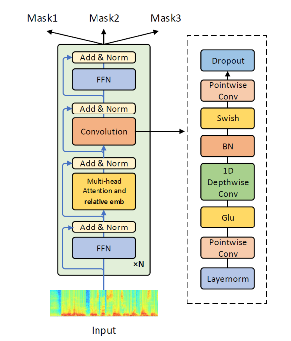
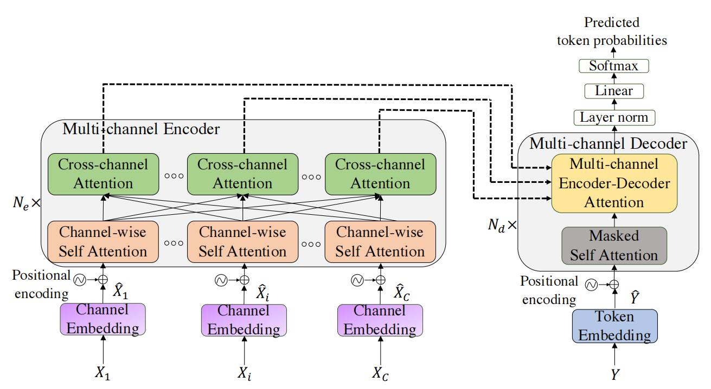

# [Paper Summary](https://github.com/FeiF-i/Record)

| 题目 | 会议/期刊 | 分类 | 时间 |
| :--- | ------ | ---- | ---- |

* 动机
* 方法

# Audio, Speech, and Language Processing
##  Speech Enhancement

- 传统方法

  - 单通道

    - 谱减法
    - 维纳滤波
    - MMSE
    - 卡尔曼滤波

  - 多通道

- A Convolutional Recurrent Neural Network for Real-Time Speech Enhancement，Interspeech2018，网络结构，2022/1/14
  -  动机：实现低延时或零延时的语音增强应用于现实应用中，如助听器、可植入耳蜗
  -  方法：提出了因果卷积encoder、decoder和LSTM组成的CRN结构

- A Deep Learning-based Kalman Filter for Speech Enhancement，Interspeech2020，传统方法+神经网络，2022/1/14
  - 动机：现有的卡尔曼滤波器(KF)在真实噪声条件下对噪声方差和线性预测系数(LPCs)的估计较差。导致增强效果差

  - 方法：采用了一种基于MMSE的噪声功率谱密度(PSD)估计的深度学习方法，称为DeepMMSE。利用估计的噪声PSD来计算噪声的方差；构造了一个白化滤波器，其系数由估计的噪声PSD计算出来。然后将其应用于有噪声的语音中，生成用于计算lpc的预白化语音。

    

- A Maximum Likelihood Approach to SNR-Progressive Learning Using Generalized Gaussian Distribution for LSTM-Based Speech Enhancement，Interspeech2021，loss，2022/1/14
  - 动机：本文认为之前提出的MMSE-PL-LSTM的MSE导致了预测误差的不均匀分布和广泛的动态范围
  - 方法：提出使用概率论中的广义高斯分布和极大似然法来建立误差  ML-PL-LSTM

- A Pyramid Recurrent Network for Predicting Crowdsourced Speech-Quality Ratings of Real-World Signals，Interspeech2020，预测MOS评分，2022/1/15
  - 动机：客观语音质量度量的现实能力是有限的，因为目前的测量方法 1)是由不能充分模拟真实环境的模拟数据开发出来的；2)他们预测的客观分数并不总是与主观评分有很强的相关性
  - 方法：我们首先通过对两个真实世界的语料库进行众包听力研究来收集一个大的质量评级数据集。我们进一步开发了一种新的方法，利用具有注意机制的金字塔双向长短期记忆(pBLSTM)网络来预测MOS评分

- COMPRESSING DEEP NEURAL NETWORKS FOR EFFICIENT SPEECH ENHANCEMENT，ICASSP2021，模型压缩，2022/1/15
  - 动机：大型的DNN可以实现强大的增强性能，这种模型既需要大的计算量，又需要消耗内存。因此，很难在硬件资源有限的设备或有严格延迟要求的应用程序中部署这样的DNN。
  - 方法：提出了一种基于稀疏正则化、迭代剪枝和基于聚类的量化三种技术的模型压缩管道来减少语音增强的DNN大小。

- DCCRN+: Channel-wise Subband DCCRN with SNR Estimation for Speech Enhancement，Interspeech2021，网络模型，2022/1/17

  - 动机：DCCRN在2020DNS challenge取得第一，21年对DCCRN做出改进。
  - 方法：一般结构与DCCRN相似，但有以下区别：1)在编码器/解码器前后使用分裂/合并模块的子带处理。2)复数的TF-LSTM同时用于频率和时间尺度的时间建模。3)添加卷积，以更好地从编码器输出的信息聚合。4)添加信噪比估计模块，以减轻噪声抑制过程中的语音失真。5)进行后处理，进一步去除剩余噪声。

- ICASSP 2021 DEEP NOISE SUPPRESSION CHALLENGE: DECOUPLING MAGNITUDE AND PHASE OPTIMIZATION WITH A TWO-STAGE DEEP NETWORK，ICASSP2021，网络结构，2022/1/17

  - 动机：在真实声环境下恢复被各种噪声污染的语音信号仍然是一个艰巨的挑战。
  - 方法：主要由两个管道组成，即一个两阶段网络和一个后处理模块。提出了第一个管道来解耦关于幅度谱和相位优化问题，即在第一阶段只预测幅度谱，并在第二阶段进一步细化预测实虚部。第二个管道旨在进一步抑制剩余的非自然扭曲噪声，这被证明可以充分提高主观质量。

  

- Deep learning for minimum mean-square error approaches to speech enhancement，Speech Communication，传统方法+神经网络，2022/1/18

  - 动机：目标是弥合MMSE和深度学习方法在语音增强方面之间的差距，产生增强的语音，从而获得比最近基于掩蔽和映射的深度学习方法更高的质量和可懂度得分
  - 方法：通过神经网络预测映射的先验信噪比 ξ ，然后用MMSE-LSA来实现增强，网络使用ResLSTM & ResBLSTM。

- DeepMMSE: A Deep Learning Approach to MMSE-Based Noise Power Spectral Density Estimation，Transaction2020，传统方法+神经网络，2022/1/18

  - 动机：精确的噪声功率谱密度(PSD)跟踪器是单通道语音增强系统不可或缺的组成部分。基于贝叶斯激励的最小均方误差(MMSE)的噪声PSD估计器是近年来最为突出的估计器。然而，由于目前的原始信噪比到噪声(SNR)估计方法，它们缺乏跟踪高度非平稳噪声源的能力
  - 方法：通过神经网络预测映射的先验信噪比 ξ，再计算noise PSD（功率谱密度），网络使用ResNet。

- DENSELY CONNECTED PROGRESSIVE LEARNING FOR LSTM-BASED SPEECH ENHANCEMENT，ICASSP2018，网络结构，2022/1/18

  - 动机：之前提出了一种新的基于深度神经网络(DNN)的语音增强的渐进学习(PL)框架，以提高在低信噪比环境下的性能。本文为此框架做出新的贡献。

  - 方法：LSTM层，SNR渐进学习将大目标分成小目标，密集连接以缓解信息丢失问题，后处理来进一步提高增强性能。

    

- A Multi-Target SNR-Progressive Learning Approach to Regression Based Speech Enhancement，网络结构，Transaction2020，2022/1/21
	- 动机：为了在低信噪比环境下实现较好的性能（网络结构同上一篇论文，这篇论文基本上是对上一篇论文的详细解释，做了更多实验）
	- 方法：提出了SNR渐进学习的LSTM网络结构，并用密集连接的方式来缓解信息丢失的问题，同时用后处理（多层取平均）来进一步提高性能。**区别：为了减少模型参数量改变了密集连接方式，只向后传递两层**

- Fusion-Net: Time-Frequency Information Fusion Y-Network for Speech Enhancement，Interspeech2021，网络结构+loss，2022/1/23

  - 动机：从时域和频域中提取的特征可能彼此互补
  - 方法：融合时域、频域进行推理，并实现直接的时域语音增强，同时使用Charbonnier loss function，它具有L2 loss的平滑且可微行还具有L1 loss对异常值的鲁棒性。

- Incorporating Embedding Vectors from a Human Mean-Opinion Score Prediction Model for Monaural Speech Enhancement，Interspeech2021，网络结构，2022/1/27

  - 动机：客观指标做网络的约束取得一定的成功，但这并不是最优的，因为客观指标和人类的听觉没有很强的相关性。
  - 方法：使用mos评分作为约束来实现语音增强。

- Learning Complex Spectral Mapping With Gated Convolutional Recurrent Networks for Monaural Speech Enhancement，Transaction2020，网络结构，2022/1/28

  - 动机：相位对语音感知质量很重要。然而，由于它缺乏谱结构，很难通过监督学习直接估计相位谱。复数谱映射的目的是从噪声语音中估计干净语音的实虚谱图，同时增强语音的幅度和相位响应。受多任务学习的启发，本文提出了一种用于复数谱映射的门控卷积递归网络(GCRN)，它相当于一个单通道语音增强的因果系统。

  - 方法：以CRN为基础，将卷积和反卷积换为门控卷积和门控反卷积，将LSTM换为Group LSTM，一个decoder换为两个decoder，一个预测实部一个预测虚部。

  	 

- Masked multi-head self-attention for causal speech enhancement ，Speech Communication2020，网络结构，2022/1/29

  - 动机：（本位为DeepXi的后续系列）rnn和tcn在建模长期依赖关系时都表现出缺陷。通过使用序列相似性，MHA（多头自注意力）具有更有效地建模长期依赖关系的能力。此外，可以使用掩蔽来确保MHA机制仍然是因果关系——这是实时处理的关键属性。基于这些观点，我们研究了一个深度神经网络(DNN)，它利用mask的MHA进行因果语音增强。
  - 方法：用多头自注意块来代替TCN中瓶颈残差块。

- MetricGAN: Generative Adversarial Networks based Black-box Metric Scores Optimization for Speech Enhancement，网络结构+loss，ICML2019，2022/1/29

  - 动机：生成对抗性网络(GAN)中的对抗性损失并不是用来直接优化目标任务的评估度量的，因此，可能并不总是指导GAN中的生成器生成具有改进的度量分数的数据。L1，L2 loss不能反应人类听觉感知。为了克服这个问题，我们提出了一种新的MetricGAN方法，目的是针对一个或多个评估指标来优化生成器。
  - 方法：

- MetricGAN+: An Improved Version of MetricGAN for Speech Enhancement，Interspeech2021，loss，2022/1/29

  - 动机：提出一些改进来提高MetricGAN的性能
  - 方法：
  	- 对于鉴别器：1）**在鉴别器的训练中包含带噪语音**：除了增强语音和干净语音外，噪声语音还用于最小化鉴别器和目标目标指标之间的距离。2）**从重放缓冲区中增加样本大小**：从前一个epoch生成的语音被重复用于训练D，这可以防止D的灾难性遗忘。
  	- 对于生成器：1）**掩码预测的可学习的Sigmoid函数**：传统的Sigmoid算法对于掩模估计不是最优的，因为它对所有频带都是相同的，并且最大值为1。每个频带可学习的Sigmoid函数更加灵活，提高了SE的性能。

- NEURAL KALMAN FILTERING FOR SPEECH ENHANCEMENT，ICASSP2021，传统方法+神经网络，2022/1/29

  - 动机：将专家知识驱动和改善过拟合问题集成到基于统计信号处理的网络设计仍然是一个悬而未决的问题。虽然架构设计有效建模不同的语音和噪声的时频依赖性，总是缺乏一个明确的标准模型设计，这使得很难解释和优化中间表示，也使性能高度依赖训练数据的多样性。
  - 方法：该方法首先从语音演变模型中得到预测，然后通过线性加权对短期瞬时观测进行积分，通过比较语音预测残差与环境噪声水平来计算权值。设计了一个端到端网络，将KF中的语音线性预测模型转换为非线性模型，并压缩所有其他传统的线性滤波操作。

- Single-channel speech enhancement using learnable loss mixup，Interspeech2021，loss，2022/1/30

  - 动机：基于监督学习的语音增强通常通过解决一个经验风险最小化(ERM)问题来训练模型。然而，这种方法的一个主要缺点是只在训练样本上学习网络行为。这种限制导致了模型在训练集之外的效果不佳。一个简单而常见的补救方法是扩展训练集，但在语音应用中获取和标记它是昂贵和费力的。另一种常见的方法是数据增强，然而，它依赖于领域，因此需要专家知识。提高泛化性，网络在看不见的噪声环境中产生稳健预测的能力，因此仍然是语音增强的一个主要挑战。

  - 方法：本文提出可学习的损失混合(LLM)，来改进基于深度学习的语音增强模型的泛化性。在损失混合（LM）训练中，按照公式1进行数据增强，并用公式2作为loss函数，本文使用可学习参数代替λ，公式3，4，5。
  	$$
  	\overline x = \lambda x_j + (1-\lambda)x_k   \tag{1}\label{}
  	$$

  	$$
  	L_{LM}=\lambda l(f(\overline x),s_j)+(1-\lambda)l(f(\overline x), s_k) \tag{2}\label{}
  	$$

  	$$
  	L_{LLM} =\phi(\lambda)l(f(\overline x),s_j)+(1-\phi(\lambda))l(f(\overline x),s_k) \tag{3}\label{}
  	$$

  	$$
  	\phi(\lambda)= \frac {\rho(\lambda)}{\rho(\lambda) + \rho(1-\lambda)}\tag{4}\label{}
  	$$

  	$$
  	\rho(\lambda) = \lambda^{C\sigma(MLP(embed(\overline x)))}\tag{5}\label{}
  	$$

  	

- TEACHER-STUDENT LEARNING FOR LOW-LATENCY ONLINE SPEECH ENHANCEMENT USING WAVE-U-NET，ICASSP2021，网络结构，2022/1/30

  - 动机：一般的幅度谱预测方法存在两个缺点：1）没有考虑相位，相位被证实是对语音增强很重要。2）窗口长度会限制最小延迟。

  - 方法：用**WAVE-U-NET**做师生学习来实现实时语音增强。

  	

- Perceptual Contrast Stretching on Target Feature for Speech Enhancement，，后处理方法，2022/4/5

  - 方法：本文提出了一种新的后处理方法PCS（perceptual contrast stretch）来进一步提升语音增强的性能，与基于后处理的实现相比，将PCS纳入训练阶段既保持了性能又减少了在线计算。
  	提出的PCS有三个有点：首先，它与不同的SE系统(传统的或基于DL的)高度兼容。其次，在SE模型中不需要额外的参数。第三，它不影响因果SE模型的因果关系。

  	

  	所提出的方法可由上图流程所示，其中C.S.可由公式(1)表示，此外，本文的SE模型的训练特征被移到log(1+p)域(log1p特征)，因此，可以推导出公式(1)得到公式(2)：
  	$$
  	Y_{t,f} = A(M_{t,f})^ \gamma  \tag 1
  	$$
  	其中M表示幅度谱特征，A为缩放函数，γ值，Y为修正信号，此部分的灵感来源 **Gamma correction**
  	$$
  	log1p(Y_{t,f} ) = log(1 + Y_{t,f} ) = γ ∗ log(1 + M_{t,f} ) \tag 2
  	$$
  	这里缩放函数A为: 
  	$$
  	(1 + 1/M_{t,f} )^γ− (1/M_{t,f} )^γ \tag 3
  	$$
  	上文最佳的γ取值从实验中验证，γ=1.4为最优值。

  	为了进一步提高对比度拉伸，以获得更好的感知性能，我们旨在基于关键波段的重要性设计我们的特征增强。根据公式(4)以及表1中的BIF值得到关键频带重要性选取对应的γ值。**注：人们可以比其他频带更好地感知到400到4400赫兹的频带的差异**

  	
  	$$
  	γ_{P CS}[k] = \frac {(γ − P CS_{min})}{ (BIF_{Max} − BIF_{min})} * BIF[k] + P CS_{min} \tag 4
  	$$
  	式中，k为频带指数。

  	最终整个网络由公式(5)表示为：
  	$$
  	L = D(SE(Log1p(X_{t,f })), Log1p(Y_{t,f} )) \tag 5
  	$$
  	D(·)为目标函数，这里的目标函数是泛指，并不是特定某一个目标函数，SE(·)为语音增强模型。

-  Optimizing Shoulder to Shoulder: A Coordinated Sub-Band Fusion Model for Real-Time Full-Band Speech Enhancement，INTERSPEECH 2022，网络结构，2022/4/21

  - 动机：由于建模更多频带的计算复杂度较高，因此基于深度神经网络的实时全宽带语音增强仍然难以进行。最近的研究通常利用相对低频率分辨率的压缩感知动机特征，通过一级网络过滤全频段频谱，导致有限的语音质量提高。
  - 方法：将原始的全频谱分为低频(LB)、中频(MB)和高频(HB)，并精心设计了三个子网络。首先对一个名为DSLB-Net的双流网络进行预训练，以解决LB复杂频谱(0-8kHz)的恢复问题，它主要包括一个幅度估计网络(ME-Net)和一个复杂净化网络(CP-Net)。然后，将预训练后的DSLBNet与另外两个高频带掩蔽网络，即MBM-Net和HBM-Net进行集成，以解决8-16kHz和16-24kHz频带。由于在更高频段的语音包含更低的能量和更少的谐波，我们只使用了幅度增益，并在8-24kHz波段保持相位不变。此外，为了利用不同频带之间的隐式相关性，在MBM-Net和HBM-Net中设计了一个子频带交互模块，旨在从估计的LB谱中提取知识作为指导。最后，将估计的低、中、高频谱融合得到全波段信号。

-  Taylor, Can You Hear Me Now? A Taylor-Unfolding Framework for Monaural Speech Enhancement，传统方法+DNN，IJCAI2022，2022/5/15

  - 动机：虽然深度学习技术促进了语音增强的快速发展，但大多数方案只追求以黑盒的方式实现的性能，并且缺乏足够的模型可解释性。
  - 方法：受泰勒近似理论的启发，我们提出了一个可解释的解耦式SE框架。它将复数谱恢复分解为两个独立的优化问题，即幅度估计和复数残差估计。具体来说，作为泰勒级数的0阶项，精心设计了一个滤波器网络，只在幅度域内抑制噪声分量，得到一个粗糙的幅度谱。为了细化相位分布，我们估计稀疏复数残差，定义为目标和粗谱之间的差，并测量相位差距。在本研究中将残差分量表示为各种高阶泰勒项的组合，并提出了一个轻量级可训练模块来替换相邻项之间的复杂导数算子。最后，根据泰勒公式，我们可以通过0阶项和高阶项之间的叠加来重建目标谱。

  

-  MANNER: MULTI-VIEW ATTENTION NETWORK FOR NOISE ERASURE，网络结构，ICASSP2022，2022/2/22

	-  动机：近年来，双路径模型被用来表示长序列特征，但它们的表示方式仍然有限，记忆效率较差
	-  方法：提出了多视图噪声消除注意网络（方式），由卷积解码器和多视图注意块组成，应用于时域信号。

	

	

	

## Speech Separation

- Conv-TasNet: Surpassing Ideal Time–Frequency Magnitude Masking for Speech Separation，transactions，网络结构，2022/1/15
  - 动机：一、时频表示进行分离存在缺点：1）相位和幅度谱信息解耦，2）时频表示的次优性，3）计算幅度谱的长延时；二、TasNet在分离任务中的缺点：1）小的卷积核回增加encoder的输出，使LSTM的训练难以管理，2）deep LSTM计算量大，3）由于LSTM的长期依赖性，导致不一样的分离精度：三、受TCN成功所激励

  * 方法：将TasNet中的LSTM换为TCN作为分离器，用depthwise separable convolution代替普通卷积来减少参数量

  
  
- DUAL-PATH MODELING FOR LONG RECORDING SPEECH SEPARATION IN MEETINGS，ICASSP2021，网络结构，2022/1/24
	- 动机：将传统的话语级语音分离扩展到连续语音分离任务的一个直接扩展方法是用一个固定大小的窗口来分割长语音，并分别处理每个窗口。这种方式虽然有效，但这种扩展不能模拟语音的长期依赖，从而导致次优的性能。最近提出的双路径建模（DPRNN）可以解决这个问题，因为它具有联合建模跨窗口依赖关系和局部窗口处理的能力。
	
	- 方法：提出了一种基于transformer的双路径系统，通过集成transform layer进行全局建模。该文章对DPRNN做出两点改进：1）用transformer来代替RNN，2）在第一个DP块之后加一个一维卷积，在最后一个DP块之前加一个一维转置卷积，首先，它可以有效地降低计算成本。其次，卷积核使局部信息更好地呈现在一个局部窗口的单帧中，这可能有利于全局信息的交互。
	
		
	
-  JOINT PHONEME ALIGNMENT AND TEXT-INFORMED SPEECH SEPARATION ON HIGHLY CORRUPTED SPEECH，ICASSP2020，网络结构，2022/1/27

	- 动机：利用文本信息可以提高语音分离的质量。然而，这通常需要在音素水平上的文本到语音的对齐。
	- 方法：提出使用递归神经网络和注意机制联合进行基于文本信息的语音-音乐分离和音素对齐。使用Dynamic Time Warping (DTW)进行序列匹配。
	
-  TRANSMASK: A COMPACT AND FAST SPEECH SEPARATION MODEL BASED ON TRANSFORMER，网络结构，ICASSP2021，2022/1/30

	- 动机：为了通过减少模型大小和推理时间，同时保持高分离质量，使这些模型更加实用，我们提出了一种新的基于转换器的语音分离方法，称为TransMask。

	- 方法：其中Transformer使用**Sandwich-Norm Transformer Layer**，经验发现，这种结构显著提高了收敛速度。

		

- Ultra Fast Speech Separation Model with Teacher Student Learning，Interspeech2021，网络结构，2022/1/30

  - 动机：Transformer利用自注意机制具有较强的长依赖建模能力，已成功地应用于语音分离。然而，由于深度编码器层，Transformer往往有沉重的运行时成本，这阻碍了它在边缘设备上的部署。由于计算效率高，首选具有较少编码层的小型Transformer模型，但它容易导致性能下降。
  - 方法：使用师生学习来解决动机中存在的问题。1）引入了分层的T-S学习机制，训练学生不仅要重现最终的预测，还要重现教师模型的中间输出。2）由于学生模型被训练来恢复教师模型的预测，因此T-S学习的表现将被限制在教师的能力上。为了避免这一限制，我们引入了客观转移机制，同时用教师的预测数据集和训练数据集来训练学生，公式1 。3）在本文中，我们的目标是利用T-S学习中的大规模无标记混合数据。通过这种方式，学生模型可以通过模拟教师的行为来接近教师模型，不仅可以针对有限的注释数据，还可以针对大规模的未标记数据。

  $$
  L = \lambda(t)L_{PIT} + (1-\lambda(t))L_{LTS} \tag{1}
  $$

-  TIME-DOMAIN LOSS MODULATION BASED ON OVERLAP RATIO FOR MONAURAL CONVERSATIONAL SPEAKER SEPARATION，ICASSP2021，loss，2022/2/14

	- 动机：在100%overlap的语音分离取得了较好的效果，但是这样的模型如果直接用的说话人日常对话的语音分离效果就会下降。
	- 方法：使用基于overlap率的时域调制损失，让网络更着重overlap区域，对非overlap区域减少注意。本文还是用Feature-wise Linear Modulation（FiLM）将语音经过VAD的向量做仿射，送入网络中。此外，在长语音拼接中用d-vector得到预测语音的embedding，并通过计算余弦相似度匹配语音。

- Continuous Speech Separation with Conformer，arXiv，网络结构，2022/2/21

	- 动机：连续语音分离最近被提出用于处理自然对话中的重叠语音。虽然它可以显著提高多通道对话转录的语音识别性能，但其在单通道记录场景中的有效性尚未得到证明。

	- 方法：本文研究了使用conformer结构代替RNN的分离模型。分离模型可以有效地捕获局部和全局上下文信息，这有助于语音分离。

		
	
-  A CONFORMER-BASED ASR FRONTEND FOR JOINT ACOUSTIC ECHO CANCELLATION, SPEECH ENHANCEMENT AND SPEECH SEPARATION，ASRU，网络结构&多任务结合，2022/2/28

	- 动机：实现用单一模型同时完成消回音，语音增强，以及语音分离这三类不同的降噪任务，从而极大地简化了降噪模型开发和部署的成本。
	- 利用近年来在语音领域十分流行的**conformer网络结构**，以及在计算机视觉领域受到欢迎的**FiLM调制器**，除了采用经典的L1和L2损失函数来描述增强后的时频谱与期望时频谱之间的差距，还额外引入了**基于ASR的损失函数**。
##  Speaker Extraction

- SpEx+: A Complete Time Domain Speaker Extraction Network，Interspeech2020，网络结构，2022/2/5
	- 动机：SpEx是时域上的说话人抽取方法，它避免了频域上的相位预测。但SpEx并不完全是时域方法， 它用频域说话人embedding作为参考。同时频域输入窗口的大小和时域分析窗口的大小不同，这种不匹配会对系统的性能产生不利的影响。
	
	- 方法：提出完全是时域的说话人抽取：SpEx+，本文在两个语音编码器之间共享相同的网络结构及其权重。这样，混合语音输入和参考语音输入表示为统一的潜在特征空间。Speech Encoder是1D-conv + Relu，Speech Decoder是1D-deconv，采用多任务学习进行训练，公式（1）。
	
		
		
		
		$$
		L = L_{SI-SDR} + \lambda L_{CE} \tag{1}
		$$
		
		$$
		L_{SI-SDR} = −[(1 − α − β)ρ(s1, s) + αρ(s2, s) + βρ(s3, s)] \tag{2}
		$$
		
		$$
		ρ(\hat s, s) = 20log_{10}\frac{||(\hat s^Ts/s^T s) · s||}{||(\hat s^T s/s^T s) · s − \hat s||} \tag{3}
		$$
		
		$$
		L_{CE} = −\sum_{i=1}^{N_s} I_ilog(σ(W · v)i) \tag4
		$$
		

- SPEAKER ACTIVITY DRIVEN NEURAL SPEECH EXTRACTION，ICASSP 2021，辅助信息，2022/3/15

	- 动机：虽然目标语音提取可以实现高水平的性能，但并不总是能够访问注册的话语或视频。

	- 方法：本文研究了另一个线索的使用，它包括一个说话者的言语活动（二分类VAD）。其中VAD信息来自说话人日志。本文最终使用（d）ADEnet-mix实现最佳效果。

		

## VAD

- SELF-ATTENTIVE VAD: CONTEXT-AWARE DETECTION OF VOICE FROM NOISE，ICASSP，网络结构，2022/1/17
	- 动机：由于注意力网络高度依赖于编解码器框架，很少有人能成功地应用它。这通常使得构建的系统对递归神经网络有高度的依赖，考虑到声学框架的尺度和特性，递归神经网络成本高昂，有时上下文较不敏感。为此用注意力机制实现VAD。
	
	* 方法：multi-resolution cochleagram (MRCG)特征做Xm，
		$$
		Vmx = \{Xm-u, ...,Xm,...,Xm+u\}
		$$
		
		$$
		Vym = \{Ym-u,...,Ym,...,Ym+u\}
		$$
		
		$$
		Y = \frac {Ym-u+...+Ym+...+Ym+u}{2u-1}
		$$
		
		Vxm 做输入，预测Vym ；embedding layer为 sinusoidal positional encoding（正弦位置编码），Boosted classifer: y 。
		
		
-  Three-class Overlapped Speech Detection using a Convolutional Recurrent Neural Network，Interspeech2021，三分类label，2022/1/30
	- 动机：在没有OSD（Overlapped Speech Detection）系统的情况下，说话人日志系统的性能会与数据集中现有的重叠部分成比例地下降，因为该模型最终忽略了重叠语音区域中的第二个说话者。
	- 方法：使用CRNN网络来实现三分类VAD。**记录：网络输出是单个标签**

# Sound Detection/Extraction

- ENVIRONMENTAL SOUND EXTRACTION USING ONOMATOPOEIC WORDS，ICASSP2022，特征信息，2022/3/22

	- 动机：准备所需声音的一种方法是从环境声音数据库中获得它。然而，目前可用的数据库的数量是非常有限的，所以你想要的声音并不总是在数据库中。另一方面，互联网上有大量未标记的环境声音，但扩展数据库并不容易，因为它需要丰富的领域知识和分类法。
	- 方法：提出了一种使用拟声词的环境声音提取方法

	
	
- DETECT WHAT YOU WANT: TARGET SOUND DETECTION，ICASSP2022，方法，2022/3/29

	- 动机：（Sound Event Detechion）SED的目标是对音频剪辑中所有预定义的声音事件（如火车喇叭、汽车警报）进行分类和定位，但当多个事件同时发生时，仍然难以得到精确的结果。（Target Sound Detection）TSD只关注目标事件，而其他事件可以看作是伴随着背景噪声的干扰，这可以降低检测重叠事件的难度。

	- 方法：为了解决TSD任务，我们提出了一个目标声音检测网络(即TSDNet)，并将TSD作为音频的每一帧的二分类问题，并对TSDNet进行有监督和弱监督的TSD任务的训练。
		强监督训练，如下图。弱监督训练在Detection Network最后添加一个线性的softmax(LinSoft)池化层。

		

# ASR

- END-TO-END MULTI-CHANNEL TRANSFORMER FOR SPEECH RECOGNITION，ICASSP2021，网络结构，2022/3/14
	- 动机：为提升ASR在噪音环境下的鲁棒性，使用多麦克风就是一种解决方法，通常多麦克风会使用beamformer作为前置处理，并于ASR级联。
	
	- 方法：本文绕过beamformer，使用端到端多通道transformer来实现ASR。
	
		
- 题目
	- 动机
	- 方法
# NLP
- Attention Is All You Need，2017NIPS，网络结构，2022/2/9

  - Transformer中抛弃了传统的CNN和RNN，整个网络结构完全是由Attention机制组成。更准确地讲，Transformer由且仅由self-Attenion和Feed Forward Neural Network组成。

  	

- 题目
  - 动机
  - 方法

# CV

- Scaling Up Your Kernels to 31x31: Revisiting Large Kernel Design in CNNs，CVPR，网络结构，2022/4/17
	- 动机：受vision transformers (ViTs)最新进展的启发，在本文证明了使用一些大的卷积内核而不是堆栈的小内核可能是一个更强大的范例，我们提出了五种指导方针，根据这些指导方针提出了RepLKNet，这是一个纯CNN架构，其内核大小高达31×31。
		五种指导方针：
		- 大的深度（depth-wise）卷积在实践中是有效的。
		- 标识快捷方式（[identity shortcut](https://blog.csdn.net/pierce_kk/article/details/96480328/)）至关重要，特别是对于大内核的网络。
		- 用小内核重新参数化有助于弥补优化问题。
		- 大卷积比ImageNet分类更能促进下游任务。
		- 大内核（例如，13×13）即使在小的特征映射（例如，7×7）上也很有用。
	- 方法：

# 数据集

- Voice Bank：纯净语音数据集  
	- **（已知，后续根据需求补充）**
	- 这个CSTR VCTK语料库包含了110个英语母语者的各种口音的语音数据。每个人朗读大约400个句子 。采样率为48kHz。
	- 英格兰口音：28名说话者——14名男性和14名女性，共11572个语音文件
	- 苏格兰和美国口语：56名说话人——男性28人，女性28人。
	- 2个英格兰口音说话人（一男一女）用于测试，共824个语音文件。
	- https://datashare.ed.ac.uk/handle/10283/2791 数据集下载地址
- Demand：噪音数据集
	- 目前的数据库分为6类，共18个场景，其中4个是室内的，2个是露天的。室内环境分为家庭、办公室、公共和交通；露天环境是街道和自然。在每个类别中都有3个环境录音，采样率为16kHz。
	- 麦克风阵列由**16个麦克风**组成，分4行交错排列，从每个麦克风到它相邻的地方有5厘米的距离。该阵列在一个在所有记录中都与地面平行的平面上。

