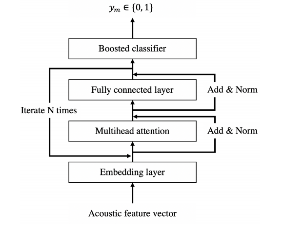

# [Paper Summary](https://github.com/FeiF-i/Record)

| 题目 | 会议/期刊 | 分类 | 时间 |
| :--- | ------ | ---- | ---- |

* 动机
* 方法

# Audio, Speech, and Language Processing
##  Speech Enhancement

- 传统方法

  - 单通道

    - 谱减法
    - 维纳滤波
    - MMSE
    - 卡尔曼滤波

  - 多通道
  
-  A Convolutional Recurrent Neural Network for Real-Time Speech Enhancement，Interspeech2018，网络结构，2022/1/14
	-  动机：实现低延时或零延时的语音增强应用于现实应用中，如助听器、可植入耳蜗
	-  方法：提出了因果卷积encoder、decoder和LSTM组成的CRN结构
	
- A Deep Learning-based Kalman Filter for Speech Enhancement，Interspeech2020，传统方法+神经网络，2022/1/14
	- 动机：现有的卡尔曼滤波器(KF)在真实噪声条件下对噪声方差和线性预测系数(LPCs)的估计较差。导致增强效果差
	
	- 方法：采用了一种基于MMSE的噪声功率谱密度(PSD)估计的深度学习方法，称为DeepMMSE。利用估计的噪声PSD来计算噪声的方差；构造了一个白化滤波器，其系数由估计的噪声PSD计算出来。然后将其应用于有噪声的语音中，生成用于计算lpc的预白化语音。
	
	  
	
-  A Maximum Likelihood Approach to SNR-Progressive Learning Using Generalized Gaussian Distribution for LSTM-Based Speech Enhancement，Interspeech2021，loss，2022/1/14
	- 动机：本文认为之前提出的MMSE-PL-LSTM的MSE导致了预测误差的不均匀分布和广泛的动态范围
	- 方法：提出使用概率论中的广义高斯分布和极大似然法来建立误差  ML-PL-LSTM
	
- A Pyramid Recurrent Network for Predicting Crowdsourced Speech-Quality Ratings of Real-World Signals，Interspeech2020，预测MOS评分，2022/1/15
	- 动机：客观语音质量度量的现实能力是有限的，因为目前的测量方法 1)是由不能充分模拟真实环境的模拟数据开发出来的；2)他们预测的客观分数并不总是与主观评分有很强的相关性
	- 方法：我们首先通过对两个真实世界的语料库进行众包听力研究来收集一个大的质量评级数据集。我们进一步开发了一种新的方法，利用具有注意机制的金字塔双向长短期记忆(pBLSTM)网络来预测MOS评分
	
- COMPRESSING DEEP NEURAL NETWORKS FOR EFFICIENT SPEECH ENHANCEMENT，ICASSP2021，模型压缩，2022/1/15
	- 动机：大型的DNN可以实现强大的增强性能，这种模型既需要大的计算量，又需要消耗内存。因此，很难在硬件资源有限的设备或有严格延迟要求的应用程序中部署这样的DNN。
	- 方法：提出了一种基于稀疏正则化、迭代剪枝和基于聚类的量化三种技术的模型压缩管道来减少语音增强的DNN大小。

-  DCCRN+: Channel-wise Subband DCCRN with SNR Estimation for Speech Enhancement，Interspeech2021，网络模型，2022/1/17

	- 动机：DCCRN在2020DNS challenge取得第一，21年对DCCRN做出改进。
	- 方法：一般结构与DCCRN相似，但有以下区别：1)在编码器/解码器前后使用分裂/合并模块的子带处理。2)复数的TF-LSTM同时用于频率和时间尺度的时间建模。3)添加卷积，以更好地从编码器输出的信息聚合。4)添加信噪比估计模块，以减轻噪声抑制过程中的语音失真。5)进行后处理，进一步去除剩余噪声。

- ICASSP 2021 DEEP NOISE SUPPRESSION CHALLENGE: DECOUPLING MAGNITUDE AND PHASE OPTIMIZATION WITH A TWO-STAGE DEEP NETWORK，ICASSP2021，网络结构，2022/1/17

  - 动机：在真实声环境下恢复被各种噪声污染的语音信号仍然是一个艰巨的挑战。
  - 方法：主要由两个管道组成，即一个两阶段网络和一个后处理模块。提出了第一个管道来解耦关于幅度谱和相位优化问题，即在第一阶段只预测幅度谱，并在第二阶段进一步细化预测实虚部。第二个管道旨在进一步抑制剩余的非自然扭曲噪声，这被证明可以充分提高主观质量。

  

-  Deep learning for minimum mean-square error approaches to speech enhancement，Speech Communication，传统方法+神经网络，2022/1/18

	- 动机：目标是弥合MMSE和深度学习方法在语音增强方面之间的差距，产生增强的语音，从而获得比最近基于掩蔽和映射的深度学习方法更高的质量和可懂度得分
	- 方法：通过神经网络预测映射的先验信噪比 ξ ，然后用MMSE-LSA来实现增强，网络使用ResLSTM & ResBLSTM。

-  DeepMMSE: A Deep Learning Approach to MMSE-Based Noise Power Spectral Density Estimation，Transaction2020，传统方法+神经网络，2022/1/18

	- 动机：精确的噪声功率谱密度(PSD)跟踪器是单通道语音增强系统不可或缺的组成部分。基于贝叶斯激励的最小均方误差(MMSE)的噪声PSD估计器是近年来最为突出的估计器。然而，由于目前的原始信噪比到噪声(SNR)估计方法，它们缺乏跟踪高度非平稳噪声源的能力
	- 方法：通过神经网络预测映射的先验信噪比 ξ，再计算noise PSD（功率谱密度），网络使用ResNet。

-  DENSELY CONNECTED PROGRESSIVE LEARNING FOR LSTM-BASED SPEECH ENHANCEMENT，ICASSP2018，网络结构，2022/1/18

	- 动机：之前提出了一种新的基于深度神经网络(DNN)的语音增强的渐进学习(PL)框架，以提高在低信噪比环境下的性能。本文为此框架做出新的贡献。

	- 方法：LSTM层，密集连接式渐进学习。

		

	

## Speech Separation

- Conv-TasNet: Surpassing Ideal Time–Frequency Magnitude Masking for Speech Separation，transactions，网络结构，2022/1/15
  - 动机：一、时频表示进行分离存在缺点：1）相位和幅度谱信息解耦，2）时频表示的次优性，3）计算幅度谱的长延时；二、TasNet在分离任务中的缺点：1）小的卷积核回增加encoder的输出，使LSTM的训练难以管理，2）deep LSTM计算量大，3）由于LSTM的长期依赖性，导致不一样的分离精度：三、受TCN成功所激励

  * 方法：将TasNet中的LSTM换为TCN作为分离器，用depthwise separable convolution代替普通卷积来减少参数量

  
  
- 题目
	- 动机
	- 方法

## ASR

- 题目
	- 动机：
	- 方法：
- 题目
	- 动机
	- 方法
## VAD

- SELF-ATTENTIVE VAD: CONTEXT-AWARE DETECTION OF VOICE FROM NOISE，ICASSP，网络结构，2022/1/17
	- 动机：由于注意力网络高度依赖于编解码器框架，很少有人能成功地应用它。这通常使得构建的系统对递归神经网络有高度的依赖，考虑到声学框架的尺度和特性，递归神经网络成本高昂，有时上下文较不敏感。为此用注意力机制实现VAD。
	
	* 方法：multi-resolution cochleagram (MRCG)特征做Xm，Vxm = {Xm-u, ...，Xm，...，Xm+u}做输入，预测Vym = {Ym-u, ...，Ym，...，Ym+u}；embedding layer为 sinusoidal positional encoding（正弦位置编码），Boosted classifer: y = (Ym-u+...+Ym+...+Ym+u)/(2u+1)。
	
		
- 题目
	- 动机
	- 方法

# CV
- 题目
	- 动机：
	
	- 方法：
- 题目
	- 动机
	- 方法
# NLP
- 题目
	- 动机：
	- 方法：
- 题目
	- 动机
	- 方法