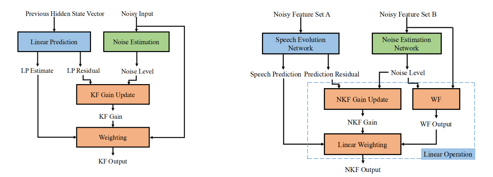

# [Paper Summary](https://github.com/FeiF-i/Record)

| 题目 | 会议/期刊 | 分类 | 时间 |
| :--- | ------ | ---- | ---- |

* 动机
* 方法

# Audio, Speech, and Language Processing
##  Speech Enhancement

- 传统方法

  - 单通道

    - 谱减法
    - 维纳滤波
    - MMSE
    - 卡尔曼滤波

  - 多通道
  
-  A Convolutional Recurrent Neural Network for Real-Time Speech Enhancement，Interspeech2018，网络结构，2022/1/14
	-  动机：实现低延时或零延时的语音增强应用于现实应用中，如助听器、可植入耳蜗
	-  方法：提出了因果卷积encoder、decoder和LSTM组成的CRN结构
	
- A Deep Learning-based Kalman Filter for Speech Enhancement，Interspeech2020，传统方法+神经网络，2022/1/14
	- 动机：现有的卡尔曼滤波器(KF)在真实噪声条件下对噪声方差和线性预测系数(LPCs)的估计较差。导致增强效果差
	
	- 方法：采用了一种基于MMSE的噪声功率谱密度(PSD)估计的深度学习方法，称为DeepMMSE。利用估计的噪声PSD来计算噪声的方差；构造了一个白化滤波器，其系数由估计的噪声PSD计算出来。然后将其应用于有噪声的语音中，生成用于计算lpc的预白化语音。
	
	  
	
-  A Maximum Likelihood Approach to SNR-Progressive Learning Using Generalized Gaussian Distribution for LSTM-Based Speech Enhancement，Interspeech2021，loss，2022/1/14
	- 动机：本文认为之前提出的MMSE-PL-LSTM的MSE导致了预测误差的不均匀分布和广泛的动态范围
	- 方法：提出使用概率论中的广义高斯分布和极大似然法来建立误差  ML-PL-LSTM
	
- A Pyramid Recurrent Network for Predicting Crowdsourced Speech-Quality Ratings of Real-World Signals，Interspeech2020，预测MOS评分，2022/1/15
	- 动机：客观语音质量度量的现实能力是有限的，因为目前的测量方法 1)是由不能充分模拟真实环境的模拟数据开发出来的；2)他们预测的客观分数并不总是与主观评分有很强的相关性
	- 方法：我们首先通过对两个真实世界的语料库进行众包听力研究来收集一个大的质量评级数据集。我们进一步开发了一种新的方法，利用具有注意机制的金字塔双向长短期记忆(pBLSTM)网络来预测MOS评分
	
- COMPRESSING DEEP NEURAL NETWORKS FOR EFFICIENT SPEECH ENHANCEMENT，ICASSP2021，模型压缩，2022/1/15
	- 动机：大型的DNN可以实现强大的增强性能，这种模型既需要大的计算量，又需要消耗内存。因此，很难在硬件资源有限的设备或有严格延迟要求的应用程序中部署这样的DNN。
	- 方法：提出了一种基于稀疏正则化、迭代剪枝和基于聚类的量化三种技术的模型压缩管道来减少语音增强的DNN大小。

-  DCCRN+: Channel-wise Subband DCCRN with SNR Estimation for Speech Enhancement，Interspeech2021，网络模型，2022/1/17

	- 动机：DCCRN在2020DNS challenge取得第一，21年对DCCRN做出改进。
	- 方法：一般结构与DCCRN相似，但有以下区别：1)在编码器/解码器前后使用分裂/合并模块的子带处理。2)复数的TF-LSTM同时用于频率和时间尺度的时间建模。3)添加卷积，以更好地从编码器输出的信息聚合。4)添加信噪比估计模块，以减轻噪声抑制过程中的语音失真。5)进行后处理，进一步去除剩余噪声。

- ICASSP 2021 DEEP NOISE SUPPRESSION CHALLENGE: DECOUPLING MAGNITUDE AND PHASE OPTIMIZATION WITH A TWO-STAGE DEEP NETWORK，ICASSP2021，网络结构，2022/1/17

  - 动机：在真实声环境下恢复被各种噪声污染的语音信号仍然是一个艰巨的挑战。
  - 方法：主要由两个管道组成，即一个两阶段网络和一个后处理模块。提出了第一个管道来解耦关于幅度谱和相位优化问题，即在第一阶段只预测幅度谱，并在第二阶段进一步细化预测实虚部。第二个管道旨在进一步抑制剩余的非自然扭曲噪声，这被证明可以充分提高主观质量。

  

-  Deep learning for minimum mean-square error approaches to speech enhancement，Speech Communication，传统方法+神经网络，2022/1/18

	- 动机：目标是弥合MMSE和深度学习方法在语音增强方面之间的差距，产生增强的语音，从而获得比最近基于掩蔽和映射的深度学习方法更高的质量和可懂度得分
	- 方法：通过神经网络预测映射的先验信噪比 ξ ，然后用MMSE-LSA来实现增强，网络使用ResLSTM & ResBLSTM。

-  DeepMMSE: A Deep Learning Approach to MMSE-Based Noise Power Spectral Density Estimation，Transaction2020，传统方法+神经网络，2022/1/18

	- 动机：精确的噪声功率谱密度(PSD)跟踪器是单通道语音增强系统不可或缺的组成部分。基于贝叶斯激励的最小均方误差(MMSE)的噪声PSD估计器是近年来最为突出的估计器。然而，由于目前的原始信噪比到噪声(SNR)估计方法，它们缺乏跟踪高度非平稳噪声源的能力
	- 方法：通过神经网络预测映射的先验信噪比 ξ，再计算noise PSD（功率谱密度），网络使用ResNet。

- DENSELY CONNECTED PROGRESSIVE LEARNING FOR LSTM-BASED SPEECH ENHANCEMENT，ICASSP2018，网络结构，2022/1/18

  - 动机：之前提出了一种新的基于深度神经网络(DNN)的语音增强的渐进学习(PL)框架，以提高在低信噪比环境下的性能。本文为此框架做出新的贡献。

  - 方法：LSTM层，SNR渐进学习将大目标分成小目标，密集连接以缓解信息丢失问题，后处理来进一步提高增强性能。

    

-   A Multi-Target SNR-Progressive Learning Approach to Regression Based Speech Enhancement，网络结构，Transaction2020，2022/1/21
	- 动机：为了在低信噪比环境下实现较好的性能（网络结构同上一篇论文，这篇论文基本上是对上一篇论文的详细解释，做了更多实验）
	- 方法：提出了SNR渐进学习的LSTM网络结构，并用密集连接的方式来缓解信息丢失的问题，同时用后处理（多层取平均）来进一步提高性能。**区别：为了减少模型参数量改变了密集连接方式，只向后传递两层**

- Fusion-Net: Time-Frequency Information Fusion Y-Network for Speech Enhancement，Interspeech2021，网络结构+loss，2022/1/23

  - 动机：从时域和频域中提取的特征可能彼此互补
  - 方法：融合时域、频域进行推理，并实现直接的时域语音增强，同时使用Charbonnier loss function，它具有L2 loss的平滑且可微行还具有L1 loss对异常值的鲁棒性。

- Incorporating Embedding Vectors from a Human Mean-Opinion Score Prediction Model for Monaural Speech Enhancement，Interspeech2021，网络结构，2022/1/27

	- 动机：客观指标做网络的约束取得一定的成功，但这并不是最优的，因为客观指标和人类的听觉没有很强的相关性。
	- 方法：使用mos评分作为约束来实现语音增强。
	
-  Learning Complex Spectral Mapping With Gated Convolutional Recurrent Networks for Monaural Speech Enhancement，Transaction2020，网络结构，2022/1/28

	- 动机：相位对语音感知质量很重要。然而，由于它缺乏谱结构，很难通过监督学习直接估计相位谱。复数谱映射的目的是从噪声语音中估计干净语音的实虚谱图，同时增强语音的幅度和相位响应。受多任务学习的启发，本文提出了一种用于复数谱映射的门控卷积递归网络(GCRN)，它相当于一个单通道语音增强的因果系统。

	- 方法：以CRN为基础，将卷积和反卷积换为门控卷积和门控反卷积，将LSTM换为Group LSTM，一个decoder换为两个decoder，一个预测实部一个预测虚部。

		 
	
- Masked multi-head self-attention for causal speech enhancement ，Speech Communication2020，网络结构，2022/1/29

	- 动机：（本位为DeepXi的后续系列）rnn和tcn在建模长期依赖关系时都表现出缺陷。通过使用序列相似性，MHA（多头自注意力）具有更有效地建模长期依赖关系的能力。此外，可以使用掩蔽来确保MHA机制仍然是因果关系——这是实时处理的关键属性。基于这些观点，我们研究了一个深度神经网络(DNN)，它利用mask的MHA进行因果语音增强。
	- 方法：用多头自注意块来代替TCN中瓶颈残差块。

-  MetricGAN: Generative Adversarial Networks based Black-box Metric Scores Optimization for Speech Enhancement，网络结构+loss，ICML2019，2022/1/29

	- 动机：生成对抗性网络(GAN)中的对抗性损失并不是用来直接优化目标任务的评估度量的，因此，可能并不总是指导GAN中的生成器生成具有改进的度量分数的数据。L1，L2 loss不能反应人类听觉感知。为了克服这个问题，我们提出了一种新的MetricGAN方法，目的是针对一个或多个评估指标来优化生成器。
	- 方法：

-  MetricGAN+: An Improved Version of MetricGAN for Speech Enhancement，Interspeech2021，loss，2022/1/29

	- 动机：提出一些改进来提高MetricGAN的性能
	- 方法：
		- 对于鉴别器：1）**在鉴别器的训练中包含带噪语音**：除了增强语音和干净语音外，噪声语音还用于最小化鉴别器和目标目标指标之间的距离。2）**从重放缓冲区中增加样本大小**：从前一个epoch生成的语音被重复用于训练D，这可以防止D的灾难性遗忘。
		- 对于生成器：1）**掩码预测的可学习的Sigmoid函数**：传统的Sigmoid算法对于掩模估计不是最优的，因为它对所有频带都是相同的，并且最大值为1。每个频带可学习的Sigmoid函数更加灵活，提高了SE的性能。

- NEURAL KALMAN FILTERING FOR SPEECH ENHANCEMENT，ICASSP2021，传统方法+神经网络，2022/1/29

	- 动机：将专家知识驱动和改善过拟合问题集成到基于统计信号处理的网络设计仍然是一个悬而未决的问题。虽然架构设计有效建模不同的语音和噪声的时频依赖性，总是缺乏一个明确的标准模型设计，这使得很难解释和优化中间表示，也使性能高度依赖训练数据的多样性。
	- 方法：该方法首先从语音演变模型中得到预测，然后通过线性加权对短期瞬时观测进行积分，通过比较语音预测残差与环境噪声水平来计算权值。设计了一个端到端网络，将KF中的语音线性预测模型转换为非线性模型，并压缩所有其他传统的线性滤波操作。

## Speech Separation

- Conv-TasNet: Surpassing Ideal Time–Frequency Magnitude Masking for Speech Separation，transactions，网络结构，2022/1/15
  - 动机：一、时频表示进行分离存在缺点：1）相位和幅度谱信息解耦，2）时频表示的次优性，3）计算幅度谱的长延时；二、TasNet在分离任务中的缺点：1）小的卷积核回增加encoder的输出，使LSTM的训练难以管理，2）deep LSTM计算量大，3）由于LSTM的长期依赖性，导致不一样的分离精度：三、受TCN成功所激励

  * 方法：将TasNet中的LSTM换为TCN作为分离器，用depthwise separable convolution代替普通卷积来减少参数量

  
  
- DUAL-PATH MODELING FOR LONG RECORDING SPEECH SEPARATION IN MEETINGS，ICASSP2021，网络结构，2022/1/24
	- 动机：将传统的话语级语音分离扩展到连续语音分离任务的一个直接扩展方法是用一个固定大小的窗口来分割长语音，并分别处理每个窗口。这种方式虽然有效，但这种扩展不能模拟语音的长期依赖，从而导致次优的性能。最近提出的双路径建模（DPRNN）可以解决这个问题，因为它具有联合建模跨窗口依赖关系和局部窗口处理的能力。
	
	- 方法：提出了一种基于transformer的双路径系统，通过集成transform layer进行全局建模。该文章对DPRNN做出两点改进：1）用transformer来代替RNN，2）在第一个DP块之后加一个一维卷积，在最后一个DP块之前加一个一维转置卷积，首先，它可以有效地降低计算成本。其次，卷积核使局部信息更好地呈现在一个局部窗口的单帧中，这可能有利于全局信息的交互。
	
		
	
-  JOINT PHONEME ALIGNMENT AND TEXT-INFORMED SPEECH SEPARATION ON HIGHLY CORRUPTED SPEECH，ICASSP2020，网络结构，2022/1/27

	- 动机：利用文本信息可以提高语音分离的质量。然而，这通常需要在音素水平上的文本到语音的对齐。
	- 方法：提出使用递归神经网络和注意机制联合进行基于文本信息的语音-音乐分离和音素对齐。使用Dynamic Time Warping (DTW)进行序列匹配。

## VAD

- SELF-ATTENTIVE VAD: CONTEXT-AWARE DETECTION OF VOICE FROM NOISE，ICASSP，网络结构，2022/1/17
	- 动机：由于注意力网络高度依赖于编解码器框架，很少有人能成功地应用它。这通常使得构建的系统对递归神经网络有高度的依赖，考虑到声学框架的尺度和特性，递归神经网络成本高昂，有时上下文较不敏感。为此用注意力机制实现VAD。
	
	* 方法：multi-resolution cochleagram (MRCG)特征做Xm，
		$$
		Vmx = \{Xm-u, ...,Xm,...,Xm+u\}
		$$
		
		$$
		Vym = \{Ym-u,...,Ym,...,Ym+u\}
		$$
		
		$$
		Y = \frac {Ym-u+...+Ym+...+Ym+u}{2u-1}
		$$
		
		Vxm 做输入，预测Vym ；embedding layer为 sinusoidal positional encoding（正弦位置编码），Boosted classifer: y 。
		
		
- 题目
	- 动机
	- 方法

# CV
- 题目
	- 动机：
	
	- 方法：
- 题目
	- 动机
	- 方法
# NLP
- 题目
	- 动机：
	- 方法：
- 题目
	- 动机
	- 方法
